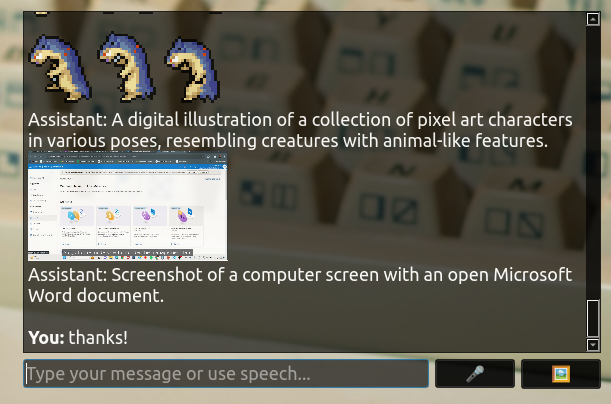

# LangChain Overlay



LangChain Overlay is an interactive chatbot application that utilizes LangChain's memory capabilities and Ollama LLM to provide a persistent and context-aware conversational experience. The overlay provides a user-friendly interface that stays on top of other windows, making it easy to interact with the chatbot while using other applications.

## Features

- **Persistent Chat Memory:** Utilizes LangChain's `ConversationBufferMemory` to maintain a consistent conversation history across sessions.
- **Context-Aware Responses:** The chatbot uses the last 10 messages to generate contextually relevant responses.
- **Overlay Interface:** A frameless, translucent window that stays on top of other windows, providing easy access to the chatbot.
- **Real-Time Chat**: Communicate with an AI-powered chatbot.
- **Speech Input**: Use speech recognition to input messages.
- **Image Input**: Add images to the chat, and the AI will automatically generate descriptions for them.
- **Save/Load Chat History**: Save your chat history to a file and load it later. Images and their descriptions are preserved.
- **System Tray Integration**: Control the application from the system tray with options to save, save as, load chat histories, and exit the application.

## Installation

Install the required libraries using pip:

```bash
pip install langchain_community PyQt5 speech_recognition
```

### Prerequisites

- Python 3.7 or higher
- Pip package manager

### Libraries

